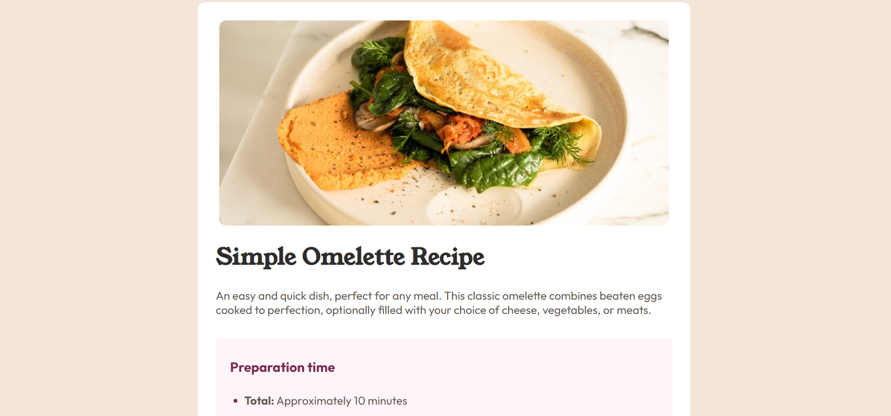

# Frontend Mentor - Recipe page solution

This is a solution to the [Recipe page challenge on Frontend Mentor](https://www.frontendmentor.io/challenges/recipe-page-KiTsR8QQKm). Frontend Mentor challenges help you improve your coding skills by building realistic projects. 

## Table of contents

- [Overview](#overview)
  - [The challenge](#the-challenge)
  - [Screenshot](#screenshot)
  - [Links](#links)
- [My process](#my-process)
  - [Built with](#built-with)
  - [What I learned](#what-i-learned)
  - [Continued development](#continued-development)
  - [Useful resources](#useful-resources)
- [Author](#author)
- [Acknowledgments](#acknowledgments)

**Note: Delete this note and update the table of contents based on what sections you keep.**

## Overview

### Screenshot




### Links

- Solution URL: https://github.com/chorong09/recipe-page.git
- Live Site URL: https://chorong09.github.io/recipe-page/

## My process

### Built with

- Semantic HTML5 markup
- CSS custom properties
- CSS Grid


### What I learned

Distinguish between ordered lists and unordered lists.
```html
<h1>Some HTML code I'm proud of</h1>
<ul>
  <li><b>Total:</b> Approximately 10 minutes</li>
  <li><b>Preparation:</b> 5 minutes</li>
  <li><b>Cooking:</b> 5 minutes</li>
</ul>
<ol>
  <li><b>Beat the eggs:</b>... </li>
  <li><b>Heat the pan:</b>... </li>
  <li><b>Cook the omelette:</b>... </li>
  <li><b>Add fillings (optional):</b>... </li>
  <li><b>Fold and serve:</b>... </li>
  <li><b>Enjoy:</b>... </li>
</ol>
```

Making table.
```html
<h1>Some HTML code I'm proud of</h1>
<table>
  <tr>
    <td>Calories</td>
    <td><b>277kcal</b></td>
  </tr>
  <tr>
    <td>Carbs</td>
    <td><b>0g</b></td>
  </tr>
  <tr>
    <td>Protein</td>
    <td><b>20g</b></td>
  </tr>
  <tr>
    <td>Fat</td>
    <td><b>22g</b></td>
  </tr>    
</table>
```

Methods for Utilizing CSS Selectors.
```css
td>b{
    color: hsl(332, 51%, 32%);
}
```


### Continued development

I will become proficient in handling CSS selectors and creating tables.


### Useful resources

- https://www.codingfactory.net/10510 - This helped me using CSS to decorate tables.


## Author

- Frontend Mentor - [@chorong09](https://www.frontendmentor.io/profile/chorong09)


## Acknowledgments

There is much to know to create a webpage. The ability to search for the necessary properties is also crucial.
